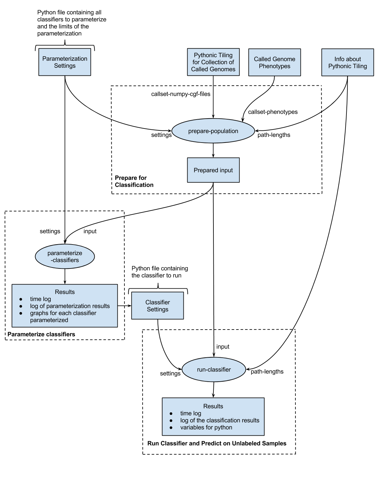

This repository contains the crunch scripts for building classifiers
on tiled genomes. To reduce computation time, the pythonic tilings were first
loaded into memory and separated into training and testing sets using the
scripts found in prepare_population_crunch_scripts. The results were saved and
passed into the classifier and parameterization scripts, found in
run_classifier_crunch_scripts.

A diagram showing how the pipeline is formatted may be found at: https://workbench.su92l.arvadosapi.com/projects/su92l-j7d0g-a2xr3l6d7dvaqo2
or below:

The pipeline templates used to run this code on Arvados are at:
* prepare_population.py and run_classifier.py: https://workbench.su92l.arvadosapi.com/pipeline_templates/su92l-p5p6p-7s7u61f9wh7c3tt
* prepare_population.py and run_svc_classifier.py: https://workbench.su92l.arvadosapi.com/pipeline_templates/su92l-p5p6p-ejkydrs80edpkxw
* prepare_population.py and find_parameters.py: https://workbench.su92l.arvadosapi.com/pipeline_templates/su92l-p5p6p-2u5s84ba9712ifo
